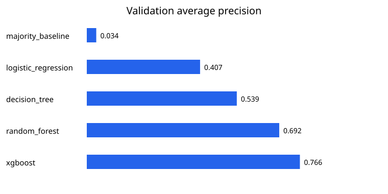

# SensorGuard ML

SensorGuard ML is a general machine-learning project for predicting machine-failure labels from equipment measurements — the ML-readiness project that comes before medical imaging or medical robotics.

> **What this is not:** real factory data or a deployable maintenance model. The UCI AI4I 2020 dataset is **synthetic** (UCI's own description), and the model is a learning project that should not control real maintenance decisions.



## Quickstart

```bash
git clone https://github.com/mghadia1/sensorguard-ml.git
cd sensorguard-ml
python3 -m venv .venv && source .venv/bin/activate
python -m pip install '.[dev,torch]'

# macOS only: XGBoost requires the OpenMP runtime
brew install libomp

# run the tests (10)
PYTHONPATH=src python -m unittest discover -s tests -v

# download the checksummed dataset, then train and evaluate
sensorguard download --destination data/raw
sensorguard train --data data/raw/ai4i2020.csv --out outputs/xgboost-comparison --with-torch
```

## Headline result

On August 4, 2026, a frozen comparison added CPU XGBoost to the same split and
validation rules. XGBoost won at threshold 0.66 and scored **precision 0.754,
recall 0.721, F1 0.737, ROC-AUC 0.977, and average precision 0.762** on the
single held-out test evaluation. The earlier random-forest result—F1 0.701 and
average precision 0.711—is preserved. Full numbers and limits:
[docs/results.md](docs/results.md). These are synthetic-dataset scores, not
real-world predictive-maintenance performance.

The project uses the UCI AI4I 2020 Predictive Maintenance dataset: 10,000 rows, CC BY 4.0. Dataset source: <https://archive.ics.uci.edu/dataset/601/ai4i>

## What the pipeline does

1. Downloads the official archive and checks its SHA-256 hash.
2. Validates columns, categories, missing values, finite values, and unique row IDs.
3. Removes IDs and five failure-mode flags from the model features.
4. Makes deterministic 60/20/20 stratified train, validation, and test splits.
5. Fits preprocessing only on training data.
6. Compares a majority baseline, logistic regression, decision tree, random forest, and CPU XGBoost.
7. Selects the model using validation average precision.
8. Selects a probability threshold using validation F1 and recall.
9. Evaluates the selected pipeline once on the held-out test split.
10. Calculates permutation importance on validation data, not test data.
11. Saves the model, metrics, predictions, comparison chart, and confusion matrix.
12. Optionally trains a small PyTorch MLP on the same split for comparison.

The verified baseline results are recorded in `docs/results.md`. Generated models and result files remain under ignored `outputs/` directories rather than being committed as source code.

## CUDA benchmark in Google Colab

[Open the CUDA benchmark in Colab](https://colab.research.google.com/github/mghadia1/sensorguard-ml/blob/agent/cuda-colab-benchmark/notebooks/sensorguard_cuda_colab.ipynb)

The notebook implements a controlled CPU-versus-CUDA XGBoost comparison on a
Colab T4. It shares one training-fitted preprocessor, uses identical frozen
hyperparameters except for `device`, records repeated fit times, and compares
average precision, ROC-AUC, and probability outputs on validation data. It does
**not** evaluate the official test split again.

The notebook has been statically validated and the CPU code path is tested
locally. CUDA results remain unverified until a successful Colab GPU run creates
`outputs/cuda-benchmark/report.json` with `status: verified_cuda_run`.

## Why some columns are excluded

`UDI` and `Product ID` are identifiers rather than operating measurements. `TWF`, `HDF`, `PWF`, `OSF`, and `RNF` are individual failure-mode target columns that directly determine `Machine failure`. Using them would leak the answer into the features and produce a misleadingly easy result.

The actual features are product type, air temperature, process temperature, rotational speed, torque, and tool wear.

## Audit the data

```bash
sensorguard audit --data data/raw/ai4i2020.csv
```

The audit validates columns, categories, missing values, finite values, and unique row IDs before any training.

## Complete the ML-readiness check

Read `docs/ml-readiness-lesson.md`. After running the project, record your explanations interactively:

```bash
sensorguard learn
```

The command saves `outputs/learning-check/answers.json`. Ask Codex to review that file. Medical ML work starts only after the answers show that the pipeline is understandable and interview-defensible.

## Batch inference

Provide a CSV containing the six feature columns, then run:

```bash
sensorguard predict \
  --model outputs/xgboost-comparison/model.joblib \
  --input examples/prediction_rows.csv \
  --out outputs/predictions.csv
```

## Honest limitations

- The source data is synthetic and has a low failure rate.
- Random stratified splitting does not simulate future deployment or a different factory.
- A good held-out score does not prove causal understanding or safe maintenance decisions.
- Threshold selection reflects F1 and recall, not a verified business cost model.
- The model is a learning project and should not control real maintenance decisions.

Read `docs/how-it-works.md` before using this project on a resume.

## Container

```bash
docker build -t sensorguard-ml .
docker run --rm sensorguard-ml
```

The Linux image installs `libgomp1` and the official minimal `xgboost-cpu`
package, avoiding unused NVIDIA/NCCL downloads. It was rebuilt and its XGBoost
3.3.0 import and CLI were smoke-tested locally on August 4, 2026.

The container is intentionally CPU-only. Use the Colab notebook for CUDA rather
than adding hundreds of megabytes of unused NVIDIA libraries to the deployment
image.
